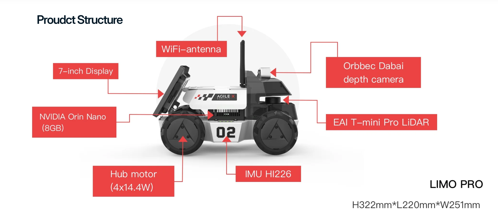
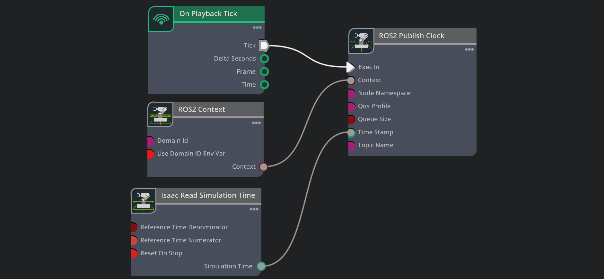
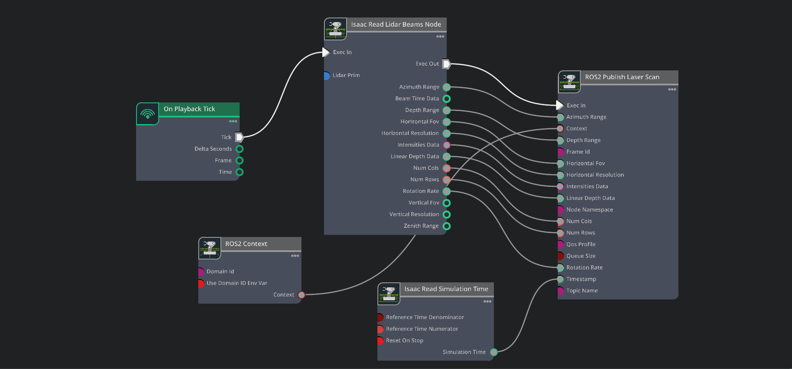
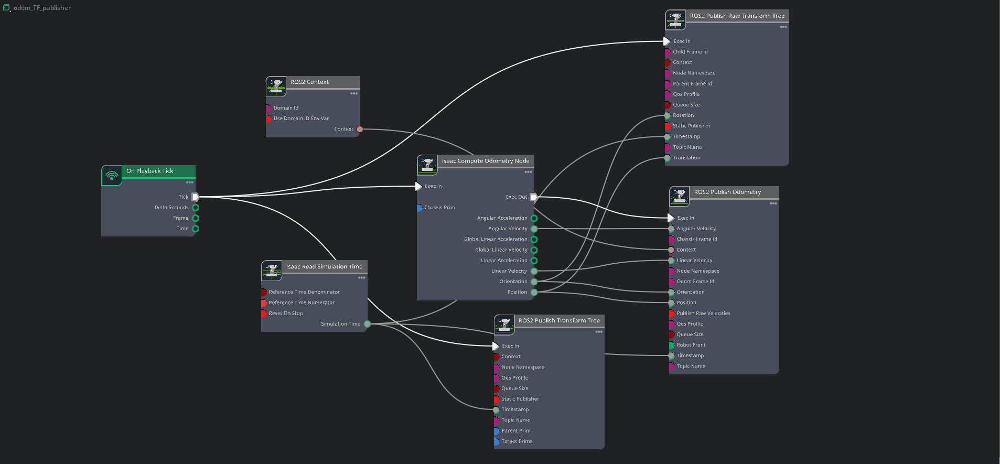
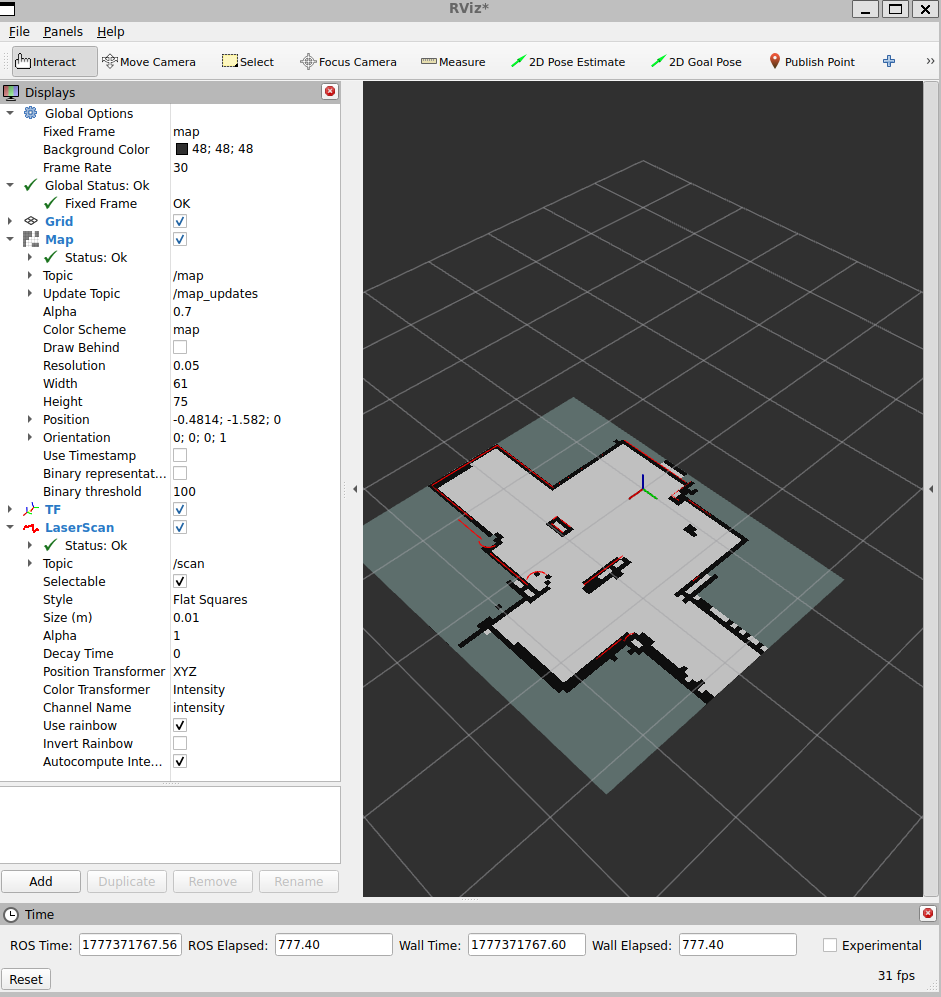
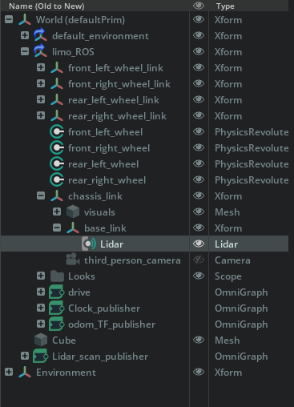

<p align="center">
  
</p>

# Isaac Sim + ROS 2 Jazzy: SLAM with AgileX Limo

This repository documents the configuration required to perform SLAM using **ROS 2 Jazzy** and **NVIDIA Isaac Sim**. 

This project serves as a step-by-step guide to configuring a robot (AgileX Limo), setting up the necessary Action Graphs, and running `slam_toolbox` to generate a map.

## 🛠 Prerequisites
- **Isaac Sim** (tested on 5.0.0)
- **ROS 2 Jazzy Jalisco**
- **slam_toolbox** (`sudo apt install ros-jazzy-slam-toolbox`)
- **nav2_map_server** (for saving the map)

---

## 🚀 Setup Instructions

### 1. Isaac Sim Robot Configuration
1. **Load Environment**: Load your desired indoor environment.
2. **Load Robot**: Load the Limo robot USD. Ensure a **Differential Controller** is already configured for the drive system.
3. **Add Lidar**: 
   - Add a Lidar sensor under a link (e.g., `base_link`).
   - This project uses the **PhysX Lidar** version.
   - **Crucial**: Ensure all environment objects have **Collision enabled**. Otherwise, laser beams will pass through walls.
   - **Debug**: In the Lidar USD properties, check `drawPoints` or `drawLines` and `enabled` to visualize the scan within Isaac Sim.

### 2. Action Graphs
To bridge Isaac Sim and ROS 2, four main Action Graphs (or one combined graph) are required:

#### **A. Clock & Simulation Time**
Publishes the simulation time to the `/clock` topic so ROS 2 stays synced with Isaac.
- **Nodes**: `On Playback Tick` -> `Isaac Read Simulation Time` -> `ROS2 Publish Clock`.

#### **B. Lidar Scan**
Converts Lidar beam data into a ROS 2 `/scan` message.
- **Nodes**: `Isaac Read Lidar Beams` -> `ROS2 Publish Laser Scan`.

#### **C. Odometry & TF (Transform Tree)**
This is the most critical part for SLAM.
1. Use the `Isaac Compute Odometry` node.
2. Select the `chassisPrim` (e.g., `/World/limo_ROS`).
3. Connect the **Orientation** and **Translation** to a `ROS2 Publish Raw Transform Tree`.
4. Set this transform from **odom** -> **base_link**. This ensures the odom frame remains stationary.
5. Create additional transforms for `base_link` to other links (lidar, wheels).

#### **D. Robot Drive (cmd_vel)**
Subscribes to movement commands.
- **Nodes**: `ROS2 Subscribe Twist` -> `Differential Controller` -> `Articulation Controller`.

---

## 🗺 Running SLAM

### 1. Verify TF Tree
Before starting SLAM, ensure your transform tree is correct. Run:
```bash
ros2 run tf2_tools view_frames
```
The hierarchy must be: `odom` -> `base_link` -> `[other_links]`.

### 2. Configure Slam Toolbox
Create a local configuration file `mapper_params_online_async.yaml`. You can copy the default from the `slam_toolbox` repo, but ensure you update the base frame:
```yaml
# Inside mapper_params_online_async.yaml
base_frame: base_link
odom_frame: odom
map_frame: map
```

### 3. Launch SLAM
Run the following command (replace with your absolute path):
```bash
ros2 launch slam_toolbox online_async_launch.py slam_params_file:=/home/user/path_to/mapper_params_online_async.yaml
```

### 4. Visualization & Control
- Open **RViz2**.
- Set the **Fixed Frame** to `map`.
- Add **Map**, **LaserScan** (`/scan`), and **TF** displays.
- Drive the robot slowly using teleop:
  ```bash
  ros2 run teleop_twist_keyboard teleop_twist_keyboard
  ```

### 5. Save the Map
Once satisfied with the map:
```bash
ros2 run nav2_map_server map_saver_cli -f map_limo
```

---

## 🖼 Media

### Action Graphs
| Clock | Lidar Config | odom/TF |
| :---: | :---: | :---: |
|  |  |  |


### SLAM Results



### Stage Hierarchy


*Correct nesting of the Lidar and Xforms.*

---

### 🤝 Contributing
This is a learning project! If you find a more efficient way to set up the Action Graphs or have tips for RTX Lidar integration, feel free to open an issue or PR.
